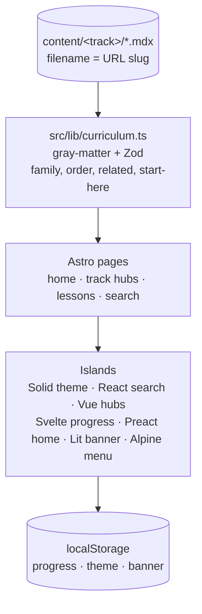

<div align="center">

# 📚 Study Desk

### Learn the ideas here. *Drill the reps with your coach.*

Structured reading for BSCP and Security+ (SY0-701 style): what to compare in a lab, which control answers it, and how the exam-shaped distinction is usually framed.

[](https://bun.sh)
[](https://www.typescriptlang.org/)
[](https://astro.build)
[](https://docs.astro.build/en/guides/framework-components/)
[](https://tailwindcss.com)
[](https://mdxjs.com)

[Quick Start](#-quick-start) · [How It Works](#-how-it-works) · [The Repo](#-whats-in-this-repo) · [Lesson Anatomy](#-anatomy-of-a-lesson) · [The Rules](#-non-negotiables) · [FAQ](#-faq--troubleshooting)

</div>

---

## 💡 What is this?

This repo is Jon Marien's **reading desk** for two certification tracks. The pages are original study notes: the idea, the evidence a tester compares, the defensive control, and the pitfall. BSCP notes follow PortSwigger Web Security Academy topic families and the Burp tools you actually drive in a lab. Security+ notes follow the public SY0-701 domain names and stay short enough to review.

Question practice stays in **Drill**, with the coach. This app is the reading half of that split.

- 📖 **Lessons are MDX files.** One file per topic under `content/`. Frontmatter is checked at build time. A bad family name, a duplicate order, or a related link that does not exist fails `bun run build`.
- 🧭 **The app is the desk around those files.** Home picks a track, each hub lists modules, search and filters narrow them, and the browser remembers what you have opened.
- 🗓️ **BSCP has a timing note.** The home page can show how many days are left before a planning date in `src/lib/study-config.ts` (21 December 2026). Dismiss it if you do not want the reminder.

> **The notes are the source of truth.** Delete the UI and the same `.mdx` files are still the curriculum. Nothing in the app invents a lesson that is not a file.

## 📋 Table of contents

- [How it works](#-how-it-works)
- [Quick start](#-quick-start)
- [What's in this repo](#-whats-in-this-repo)
- [Anatomy of a lesson](#-anatomy-of-a-lesson)
- [The two tracks](#-the-two-tracks)
- [Non-negotiables](#-non-negotiables)
- [FAQ / troubleshooting](#-faq--troubleshooting)
- [Status & roadmap](#-status--roadmap)

## 🔭 How it works

Each lesson is one MDX file. Astro content collections check the frontmatter and render static pages. Interactive pieces are islands, so each one can be a different UI framework. Progress, theme, and the BSCP banner live in this browser.



The same picture in plain ASCII:

```
  content/bscp/*.mdx ─────────────┐
                                  ├──► Zod loader ──► static pages
  content/security-plus/*.mdx ───┘         │
                                           ▼
                          home · /bscp · /security-plus · /search
                                           │
                                           ▼
                     this browser only: progress, theme, banner
```

Opening a lesson marks it **in progress** if you had not marked it yet. Marking it **done** sticks; opening it again does not move it back. Search is `/` or Ctrl/Cmd+K. Escape closes it. Arrow keys move the results.

## 🚀 Quick start

Bun is the package manager and the script runner. Bun 1.4 writes a text `bun.lock` by default. This repo sets `saveTextLockfile = false` in `bunfig.toml`, so a clean install uses the binary **`bun.lockb`** lockfile.

### Path 1 — read the desk

From a clean clone:

```bash
bun install
bun run dev
```

Open the URL Bun prints (usually `http://localhost:4321`).

### Path 2 — add a lesson

Create `content/bscp/your-slug.mdx` or `content/security-plus/your-slug.mdx`, then follow [Anatomy of a lesson](#-anatomy-of-a-lesson). The filename is the URL slug: lowercase letters, numbers, and hyphens.

```bash
bun run build
```

The build typechecks the app and compiles every lesson. If frontmatter, family, order, or a related link is wrong, the error names the file.

### Path 3 — production

```bash
bun run build
bun run start
bun run lint
```

## 📁 What's in this repo

```
cert-study/
├── src/pages/               🌐 Routes: home, track hubs, lessons, search, about
├── src/components/          🧩 Astro layout plus one folder per UI framework
├── src/lib/                 ⚙️ Curriculum checks, schema, tracks, search, keys
│   └── study-config.ts      🗓️ BSCP planning date
├── src/content.config.ts    📚 Astro content collections for the MDX lessons
├── content/
│   ├── bscp/                🔓 BSCP lessons (*.mdx)
│   └── security-plus/       🛡️ Security+ lessons (*.mdx)
├── astro.config.mjs         🏝️ Framework integrations
├── bunfig.toml              📦 Forces the binary bun.lockb lockfile
└── bun.lockb                🔒 Lockfile committed for a clean clone
```

| Path | What it is |
| --- | --- |
| **`src/pages/`** | Astro routes. Home, `/bscp`, `/security-plus`, `/[track]/[slug]`, `/search`, `/about`. |
| **`src/components/react/`** | Search dialog. |
| **`src/components/vue/`** | Track hub filters and module list. |
| **`src/components/svelte/`** | Lesson progress buttons. Opening a lesson marks it in progress. |
| **`src/components/solid/`** | Light / Dark control. |
| **`src/components/preact/`** | Home progress, continue card, and opening notes. |
| **`src/components/lit/`** | BSCP timing banner, as a Lit custom element. |
| **`src/alpine.ts`** | Mobile menu, the Search button, and the About page progress tools. |
| **`src/lib/curriculum.ts`** | Reads `content/`, validates frontmatter, builds search text, and picks previous/next among **ready** lessons only. |
| **`src/lib/tracks.ts`** | Track copy, family names, and the start-here slugs. A lesson `family` must match a name here. |
| **`src/lib/study-config.ts`** | `BSCP_LICENSE_ENDS`. Change this if the real Burp Suite Professional end date differs. |
| **`content/`** | The curriculum. 54 ready notes and 13 labeled outlines (67 files). |

To add an island, put the component in the matching folder and use a `client:*` directive. React, Preact, and Solid all speak JSX, so `astro.config.mjs` limits each integration to its own folder. Vue and Svelte are picked up from their file extensions. Alpine is available on any page. Lit elements are defined in `src/components/lit/` and loaded with a `<script>` tag, which is the current Astro path for Lit.

Progress keys, if you are inspecting the browser: `marien-study-progress`, `marien-study-theme`, `marien-study-bscp-banner`. There is no account. Clear progress from the About page.

## 🧬 Anatomy of a lesson

One `.mdx` file. The filename is the slug. Frontmatter first:

```yaml
---
title: Short title
family: Server-side
order: 45
status: ready          # or outline
minutes: 12
summary: One or two sentences that show up on the hub and in search.
objectives:
  - A behavior the reader should be able to explain
  - A second objective
academy: SQL injection # optional; BSCP Academy topic name
related:
  - track: security-plus
    slug: vulnerability-types
tags:
  - injection
---
```

| Field | Rule |
| --- | --- |
| `family` | Exact name from `src/lib/tracks.ts` for that track. |
| `order` | Integer, unique inside the track. Ready notes use the study path (10, 20, 30…). Outlines use **1000 and up** so they sit at the bottom of a family and stay off previous/next. |
| `status` | `ready` or `outline`. A stub should also start the body with `## TODO` so the badge and the file agree. |
| `minutes` | Integer from 1 to 90. |
| `summary` | At least 24 characters. Quote it if it contains a colon. An unquoted colon breaks the YAML parser. |
| `objectives` | 2 to 6 strings, each at least 8 characters. |
| `academy` | Optional public Academy topic name. Names only. |
| `related` | Up to 6 `{ track, slug }` pairs. The slug must exist. A lesson cannot link to itself. |
| `tags` | 1 to 8 tags matching `^[a-z0-9-]+$`. |

Body callouts, each at most once per file. Leave a blank line after the opening tag and before the closing tag so Markdown inside the callout is parsed.

```mdx
## Core idea

Explain the trust boundary.

<Lab>

What to compare in Burp. No payloads.

</Lab>

<Defend>

The control that removes the class of bug.

</Defend>

<Pitfall>

A mistake people make when studying this.

</Pitfall>
```

Security+ notes use `<Exam>` when the point is how a stem is usually framed. Do not write sample exam questions.

The MDX compiler keeps these components and strips other `{expressions}`. In the body, avoid raw `{` `}` and avoid `<` except on `Lab`, `Defend`, `Pitfall`, and `Exam`.

## 🎯 The two tracks

| Track | Route | Families | Start here |
| --- | --- | --- | --- |
| **BSCP** | `/bscp` | Method, Burp workflow, Server-side, Authentication, Client-side | How to study, Proxy, SQL injection, Access control |
| **Security+** | `/security-plus` | General concepts, Threats and mitigations, Architecture, Operations, Program management | General concepts, Vulnerability types, Identity and access, Risk management |

BSCP covers Academy families at study level: server-side issues, authentication and session ideas, client-side browser rules, and when to use Proxy, Repeater, Intruder, Logger, and Collaborator. Security+ follows the five public SY0-701 domain names. Confirm current domain weights against CompTIA's outline before you sit. These notes paraphrase the ideas. They do not copy the official objective list.

Outlines already in the tree (business logic, race conditions, cache poisoning, host headers, API testing, WebSockets, prototype pollution, and the Security+ stubs for change, PKI, assets, automation, awareness, and audits) are labeled and excluded from previous/next until their `status` is `ready` and their `order` moves onto the study path.

## 🔒 Non-negotiables

1. **Study-level concepts and lab technique.** Describe what to look for and how a tester or defender reasons. Academy labs are where specific syntax belongs, and only against targets you are allowed to test.
2. **No exploit procedures.** No proof-of-concepts, weaponized payloads, malware, copy-paste attack scripts, wordlists, or tool walkthroughs that fire an attack.
3. **No question banks.** No copied CompTIA or PortSwigger exam items, and no original quiz engine or flashcard deck in this app. Drill owns the reps.
4. **Original prose.** Citing a public Academy topic name in `academy:` is fine. Pasting their lab solutions is not.
5. **The build is the editor.** Invalid frontmatter, a family that is not in `src/lib/tracks.ts`, a duplicate `order`, a related slug that does not exist, or a start-here slug that is missing or still an outline fails the build with `Content error:`.
6. **Progress stays on this machine.** `localStorage` only. No accounts in v1.

## ❓ FAQ / troubleshooting

<details>
<summary><b><code>bun run build</code> says <code>Content error</code>.</b></summary>

The message names the file. Usual causes: a `family` string that does not match `src/lib/tracks.ts`, two lessons in one track sharing an `order`, a `related` slug that does not exist, an unquoted colon in `summary`, or a start-here slug in `src/lib/tracks.ts` that is missing or still an outline.
</details>

<details>
<summary><b>How do I switch light and dark?</b></summary>

The header has a Light / Dark control. The choice is stored in this browser as `marien-study-theme`. Until you pick one, the desk follows the system theme.
</details>

<details>
<summary><b>Where did my progress go?</b></summary>

It is in this browser, under `marien-study-progress`. Another browser, a private window, or clearing site data starts you over. The About page can clear it on purpose.
</details>

<details>
<summary><b>The BSCP countdown looks wrong.</b></summary>

The date is a planning constant, `BSCP_LICENSE_ENDS` in `src/lib/study-config.ts`, set to 21 December 2026 (about 90 days from when the desk was set up). Replace it with the real Burp Suite Professional end date. Dismissing the banner only hides it in this browser.
</details>

<details>
<summary><b>Which UI framework owns which control?</b></summary>

Solid is the theme control. React is search. Vue is the track hub. Svelte is lesson progress. Preact is the home progress summary. Lit is the BSCP banner. Alpine is the mobile menu, the Search button, and the About page tools. Pages, lesson prose, and MDX callouts stay in Astro. New islands go in `src/components/&lt;framework&gt;/`.
</details>

<details>
<summary><b>Can I add a quiz?</b></summary>

No. Question practice stays in Drill. New files here are reading notes.
</details>

## 📈 Status & roadmap

**Usable.** Both tracks are navigable. 54 lessons are ready notes. 13 are labeled outlines with a TODO list, sorted under their family and kept off the previous/next path.

- [x] Home, track hubs, lesson pages, search, local progress, dark mode
- [x] Astro islands for React, Vue, Svelte, Solid, Preact, Lit, and Alpine
- [x] BSCP ready notes for the high-yield Academy families and the five Burp tools
- [x] Security+ ready notes across the five SY0-701 style domains
- [ ] Fill the labeled outlines (business logic, race conditions, cache poisoning, host headers, API testing, WebSockets, prototype pollution, and the six Security+ stubs)
- [ ] Adjust `BSCP_LICENSE_ENDS` if the real license date differs from 21 December 2026

---

<div align="center">

**Built by Jon Marien** · MIT · *learn the ideas, drill the reps with your coach*

</div>
