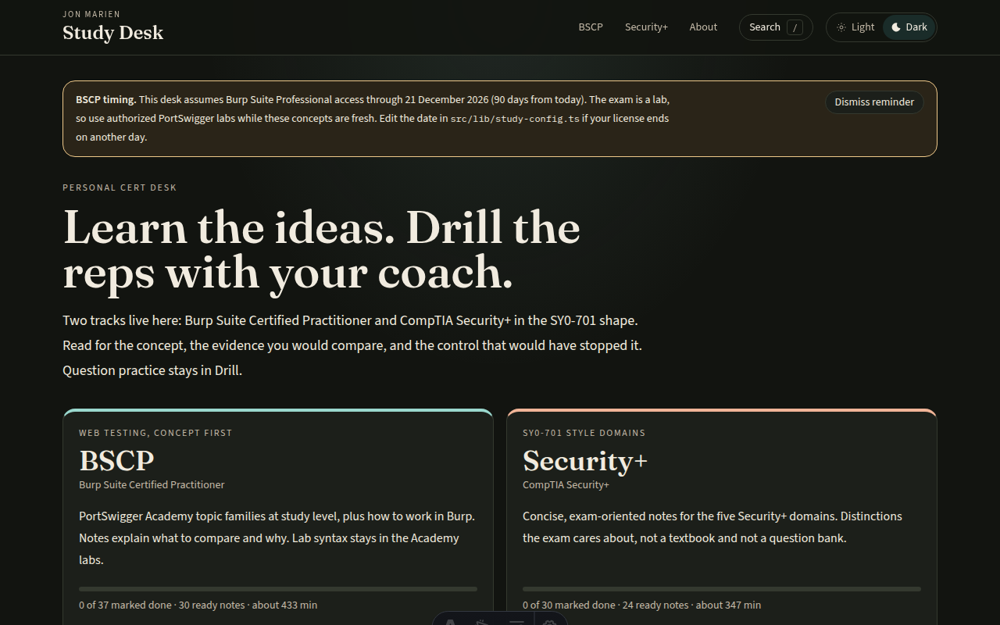
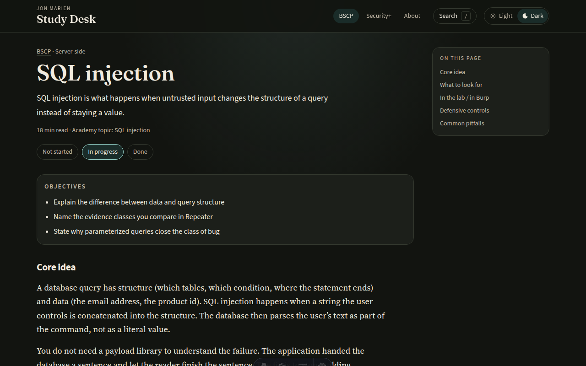
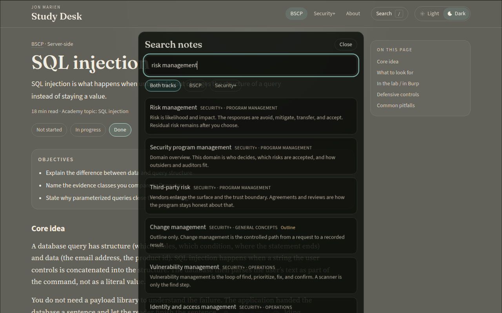
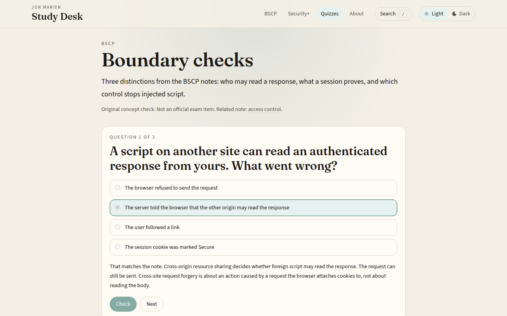
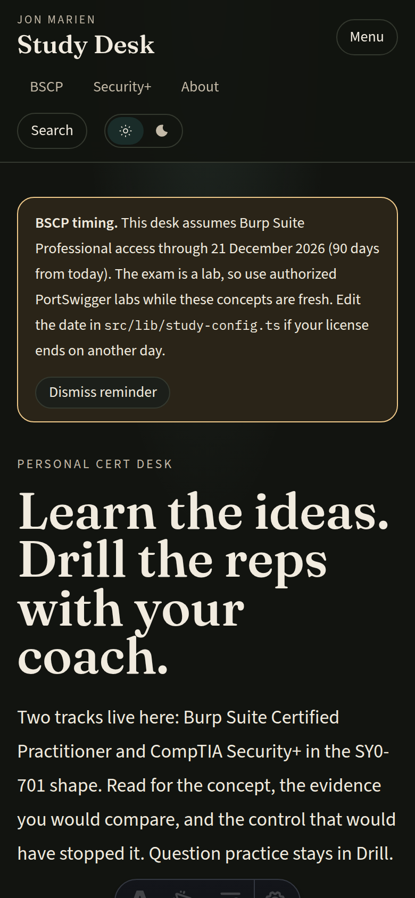
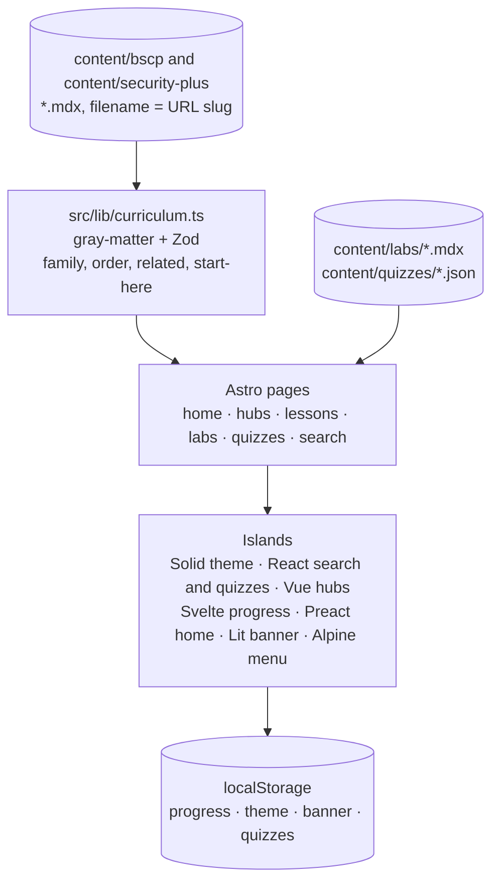

<div align="center">

# 📚 Study Desk

### Learn the ideas here. *Drill the reps with your coach.*

Structured reading for BSCP and Security+ (SY0-701 style): what to compare in a lab, which control answers it, and how the exam-shaped distinction is usually framed.

[](https://bun.sh)
[](https://www.typescriptlang.org/)
[](https://astro.build)
[](https://docs.astro.build/en/guides/framework-components/)
[](https://tailwindcss.com)
[](https://mdxjs.com)


[Quick Start](#-quick-start) · [Screenshots](#-screenshots) · [How It Works](#-how-it-works) · [The Repo](#-whats-in-this-repo) · [Lesson Anatomy](#-anatomy-of-a-lesson) · [Quizzes](#-adding-a-quiz) · [On the desk](#-on-the-desk) · [The Rules](#-non-negotiables) · [FAQ](#-faq--troubleshooting)

</div>

---

## 💡 What is this?

This repo is Jon Marien's **reading desk** for two certification tracks. The pages are original study notes: the idea, the evidence a tester compares, the defensive control, and the pitfall. BSCP notes follow PortSwigger Web Security Academy topic families and the Burp tools you actually drive in a lab. Security+ notes follow the public SY0-701 domain names and stay short enough to review.

Longer question practice stays in **Drill**, with the coach. The desk itself has short original concept checks under Quizzes, and a Labs section for the concept figures.

- 📖 **Lessons are MDX files.** One file per topic under `content/`. Frontmatter is checked at build time. A bad family name, a duplicate order, or a related link that does not exist fails `bun run build`.
- 🧭 **The app is the desk around those files.** Home picks a track, each hub lists modules, search and filters narrow them, and the browser remembers what you have opened.
- 🗓️ **BSCP has a timing note.** The home page can show how many days are left before a planning date in `src/lib/study-config.ts` (21 December 2026). Dismiss it if you do not want the reminder.

> **The notes are the source of truth.** Delete the UI and the same `.mdx` files are still the curriculum. Nothing in the app invents a lesson that is not a file.

## 📋 Table of contents

- [Screenshots](#-screenshots)
- [How it works](#-how-it-works)
- [Quick start](#-quick-start)
- [What's in this repo](#-whats-in-this-repo)
- [Anatomy of a lesson](#-anatomy-of-a-lesson)
- [Adding a quiz](#-adding-a-quiz)
- [The two tracks](#-the-two-tracks)
- [On the desk](#-on-the-desk)
- [Non-negotiables](#-non-negotiables)
- [FAQ / troubleshooting](#-faq--troubleshooting)
- [Status & roadmap](#-status--roadmap)

## 📸 Screenshots

The banner above is an illustration. These are the running desk.

<p align="center">
  
</p>

<p align="center">
  
  
</p>

<p align="center">
  
</p>

<p align="center">
  
  
</p>

## 🔭 How it works

Each lesson is one MDX file. Astro content collections check the frontmatter and render static pages. Interactive pieces are islands, so each one can be a different UI framework. Moving between pages uses Astro's client router. Opening search uses React's view transitions. Progress, theme, and the BSCP banner live in this browser.



The same picture in plain ASCII:

```
  content/bscp/*.mdx ─────────────┐
                                  ├──► Zod loader ──► static pages
  content/security-plus/*.mdx ───┘         │
  content/labs/*.mdx ──────────────────────┤
  content/quizzes/*.json ──────────────────┘
                                           ▼
        home · /bscp · /security-plus · /labs · /quizzes · /search
                                           │
                                           ▼
     this browser only: progress, theme, banner, custom quizzes, scores
```

Opening a lesson marks it **in progress** if you had not marked it yet. Marking it **done** sticks; opening it again does not move it back. Search is `/` or Ctrl/Cmd+K. Escape closes it. Arrow keys move the results.

## 🚀 Quick start

Bun is the package manager and the script runner. Bun 1.4 writes a text `bun.lock` by default. This repo sets `saveTextLockfile = false` in `bunfig.toml`, so a clean install uses the binary **`bun.lockb`** lockfile.

### Path 1 — read the desk

From a clean clone:

```bash
bun install
bun run dev
```

Open the URL Bun prints (usually `http://localhost:4321`).

### Path 2 — add a lesson

Create `content/bscp/your-slug.mdx` or `content/security-plus/your-slug.mdx`, then follow [Anatomy of a lesson](#-anatomy-of-a-lesson). The filename is the URL slug: lowercase letters, numbers, and hyphens.

```bash
bun run build
```

The build typechecks the app and compiles every lesson. If frontmatter, family, order, or a related link is wrong, the error names the file.

### Path 3 — production

```bash
bun run build
bun run start
bun run lint
```

## 📁 What's in this repo

```
cert-study/
├── src/pages/               🌐 Routes: home, hubs, lessons, labs, quizzes, search, about
├── src/components/          🧩 Astro layout plus one folder per UI framework
├── src/lib/                 ⚙️ Curriculum checks, schema, tracks, search, keys
│   └── study-config.ts      🗓️ BSCP planning date
├── src/content.config.ts    📚 Collections: lessons, labs, and quizzes
├── content/
│   ├── bscp/                🔓 BSCP lessons (*.mdx)
│   ├── security-plus/       🛡️ Security+ lessons (*.mdx)
│   ├── labs/                🔬 Concept figures from the Quartz lab notes (*.mdx)
│   └── quizzes/             ✅ Concept checks (*.json)
├── astro.config.mjs         🏝️ Framework integrations
├── bunfig.toml              📦 Forces the binary bun.lockb lockfile
└── bun.lockb                🔒 Lockfile committed for a clean clone
```

| Path | What it is |
| --- | --- |
| **`src/pages/`** | Astro routes. Home, `/bscp`, `/security-plus`, `/[track]/[slug]`, `/quizzes`, `/labs`, `/search`, `/about`. `/edit/[track]/[slug]` exists only while `bun run dev` is running. |
| **`src/components/react/`** | Search dialog, quiz player, in-browser quiz editor, and the dev-only lesson editor. |
| **`src/components/vue/`** | Track hub filters and module list. |
| **`src/components/svelte/`** | Lesson progress buttons. Opening a lesson marks it in progress. |
| **`src/components/solid/`** | Light / Dark control. |
| **`src/components/preact/`** | Home progress, continue card, and opening notes. |
| **`src/components/lit/`** | BSCP timing banner, as a Lit custom element. |
| **`src/alpine.ts`** | Mobile menu, the Search button, and the About page progress tools. |
| **`src/lib/curriculum.ts`** | Reads `content/`, validates frontmatter, builds search text, and picks previous/next among **ready** lessons only. |
| **`src/lib/tracks.ts`** | Track copy, family names, and the start-here slugs. A lesson `family` must match a name here. |
| **`src/lib/study-config.ts`** | `BSCP_LICENSE_ENDS`. Change this if the real Burp Suite Professional end date differs. |
| **`content/`** | 68 lesson files: 38 BSCP (33 ready, 5 outlines) and 30 Security+ (24 ready, 6 outlines). Nine lab pages in `content/labs/`. Two shipped quizzes in `content/quizzes/`. |

To add an island, put the component in the matching folder and use a `client:*` directive. React, Preact, and Solid all speak JSX, so `astro.config.mjs` limits each integration to its own folder. Vue and Svelte are picked up from their file extensions. Alpine is available on any page. Lit elements are defined in `src/components/lit/` and loaded with a `<script>` tag, which is the current Astro path for Lit.

The UI packages are on the current stable releases: Astro 7.3, React 19.3, Vue 3.5, Svelte 5, Solid 1.9, Preact 10, Lit 3, and Alpine 3. The tab icon is `public/favicon.svg`, with a generated PNG at `public/favicon.png`.

Browser keys, if you are inspecting storage: `marien-study-progress`, `marien-study-theme`, `marien-study-bscp-banner`, `marien-study-quizzes`, and `marien-study-quiz-scores`. There is no account. Clear progress from the About page. Custom quizzes live only in that browser until you download the JSON.

## 🧬 Anatomy of a lesson

One `.mdx` file. The filename is the slug. Frontmatter first:

```yaml
---
title: Short title
family: Server-side
order: 45
status: ready          # or outline
minutes: 12
summary: One or two sentences that show up on the hub and in search.
objectives:
  - A behavior the reader should be able to explain
  - A second objective
academy: SQL injection # optional; BSCP Academy topic name
related:
  - track: security-plus
    slug: vulnerability-types
tags:
  - injection
---
```

| Field | Rule |
| --- | --- |
| `family` | Exact name from `src/lib/tracks.ts` for that track. |
| `order` | Integer, unique inside the track. Ready notes use the study path (10, 20, 30…). Outlines use **1000 and up** so they sit at the bottom of a family and stay off previous/next. |
| `status` | `ready` or `outline`. A stub should also start the body with `## TODO` so the badge and the file agree. |
| `minutes` | Integer from 1 to 90. |
| `summary` | At least 24 characters. Quote it if it contains a colon. An unquoted colon breaks the YAML parser. |
| `objectives` | 2 to 6 strings, each at least 8 characters. |
| `academy` | Optional public Academy topic name. Names only. |
| `related` | Up to 6 `{ track, slug }` pairs. The slug must exist. A lesson cannot link to itself. |
| `tags` | 1 to 8 tags matching `^[a-z0-9-]+$`. |

Body callouts, each at most once per file. Leave a blank line after the opening tag and before the closing tag so Markdown inside the callout is parsed.

```mdx
## Core idea

Explain the trust boundary.

<Lab>

What to compare in Burp. No payloads.

</Lab>

<Defend>

The control that removes the class of bug.

</Defend>

<Pitfall>

A mistake people make when studying this.

</Pitfall>
```

Security+ notes use `<Exam>` when the point is how a stem is usually framed. Do not write sample exam questions.

The MDX compiler keeps these components and strips other `{expressions}`. In the body, avoid raw `{` `}` and avoid `<` except on `Lab`, `Defend`, `Pitfall`, and `Exam`.

## 🧩 Adding a quiz

A quiz is one JSON file, or a quiz you save from `/quizzes/new`. The filename is the slug.

```json
{
  "title": "Boundary checks",
  "track": "bscp",
  "summary": "At least twenty-four characters describing the check.",
  "lesson": { "track": "bscp", "slug": "access-control" },
  "questions": [
    {
      "prompt": "A full question, at least twelve characters.",
      "choices": ["First distinct choice", "Second distinct choice"],
      "answer": 0,
      "explain": "Why that choice matches the note, in your own words."
    }
  ]
}
```

`track` is `bscp`, `security-plus`, or `mixed`. `answer` is the index of the correct choice. `lesson` is optional and must point at a real note. Download from the editor writes this shape. Put the file in `content/quizzes/` and run `bun run build`.

Two files ship with the repo:

| File | Track | Tied to |
| --- | --- | --- |
| `content/quizzes/boundary-checks.json` | BSCP | Access control |
| `content/quizzes/control-distinctions.json` | Security+ | Security controls |

## 🎯 The two tracks

| Track | Route | Families | Start here |
| --- | --- | --- | --- |
| **BSCP** | `/bscp` | Method, Burp workflow, Server-side, Authentication, Client-side | How to study, Proxy, SQL injection, Access control |
| **Security+** | `/security-plus` | General concepts, Threats and mitigations, Architecture, Operations, Program management | General concepts, Vulnerability types, Identity and access, Risk management |

BSCP covers Academy families at study level: server-side issues (including race conditions), authentication and session ideas, client-side browser rules (including WebSockets and web LLM features), and when to use Proxy, Repeater, Intruder, Logger, and Collaborator. Security+ follows the five public SY0-701 domain names. Confirm current domain weights against CompTIA's outline before you sit. These notes paraphrase the ideas. They do not copy the official objective list.

Eleven files are still outlines. They are labeled, sorted under their family with `order` at 1000 or above, and kept off previous/next until `status` is `ready` and `order` moves onto the study path.

| Track | Outlines |
| --- | --- |
| **BSCP** | API testing, business logic flaws, web cache poisoning, host header attacks, prototype pollution |
| **Security+** | Change management, PKI and certificates, asset management, automation and orchestration, security awareness, audits and assessments |

## 📚 On the desk

Ready notes are the study path. Method covers how to study, scope, and reading an app. The five Burp tools each have a note (Proxy, Repeater, Logger, Intruder, Collaborator). Server-side ready notes run from access control through information disclosure, including race conditions. Authentication covers sessions, failures, MFA, OAuth, and JWTs. Client-side ready notes cover CORS, Content Security Policy, clickjacking, DOM-based issues, WebSockets, and web LLM features. Security+ has ready notes in every domain; the six stubs above are the gaps.

`/labs` is nine pages from the Quartz lab notes. Each one links to a BSCP lesson. Seven include a concept figure under `public/labs/`. SQL injection and web LLM are the comparison only: the vault screenshots for those topics show solved requests, so they are not in this repo.

| Lab page | Figure | Lesson |
| --- | --- | --- |
| Clickjacking | `clickjacking-layers.webp` | `/bscp/clickjacking` |
| CORS | `cors-flow.png` | `/bscp/cors` |
| Access control | `access-control-flow.png` | `/bscp/access-control` |
| Authentication | `authentication-checks.png` | `/bscp/authentication-failures` |
| SSRF | `ssrf-flow.webp` | `/bscp/ssrf` |
| SQL injection | comparison only | `/bscp/sql-injection` |
| Race conditions | `race-one-at-a-time.webp`, `race-window.webp` | `/bscp/race-conditions` |
| WebSockets | `websocket-flow.png` | `/bscp/websockets` |
| Web LLM | comparison only | `/bscp/web-llm` |

## 🔒 Non-negotiables

1. **Study-level concepts and lab technique.** Describe what to look for and how a tester or defender reasons. Academy labs are where specific syntax belongs, and only against targets you are allowed to test.
2. **No exploit procedures.** No proof-of-concepts, weaponized payloads, malware, copy-paste attack scripts, wordlists, or tool walkthroughs that fire an attack.
3. **No copied exam items.** Quizzes in `content/quizzes`, and quizzes saved in this browser, are original concept checks. Do not paste CompTIA or PortSwigger questions.
4. **Original prose.** Citing a public Academy topic name in `academy:` is fine. Pasting their lab solutions is not.
5. **The build checks the files.** Invalid frontmatter, a family that is not in `src/lib/tracks.ts`, a duplicate `order`, a related slug that does not exist, or a start-here slug that is missing or still an outline fails the build with `Content error:`. While `bun run dev` is running, the lesson editor runs those same checks before it writes.
6. **Progress stays on this machine.** `localStorage` only. No accounts in v1.

## ❓ FAQ / troubleshooting

<details>
<summary><b><code>bun run build</code> says <code>Content error</code>.</b></summary>

The message names the file. Usual causes: a `family` string that does not match `src/lib/tracks.ts`, two lessons in one track sharing an `order`, a `related` slug that does not exist, an unquoted colon in `summary`, or a start-here slug in `src/lib/tracks.ts` that is missing or still an outline.
</details>

<details>
<summary><b>How do I switch light and dark?</b></summary>

The header has a Light / Dark control. The choice is stored in this browser as `marien-study-theme`. Until you pick one, the desk follows the system theme.
</details>

<details>
<summary><b>Where did my progress go?</b></summary>

It is in this browser, under `marien-study-progress`. Another browser, a private window, or clearing site data starts you over. The About page can clear it on purpose.
</details>

<details>
<summary><b>The BSCP countdown looks wrong.</b></summary>

The date is a planning constant, `BSCP_LICENSE_ENDS` in `src/lib/study-config.ts`, set to 21 December 2026 (about 90 days from when the desk was set up). Replace it with the real Burp Suite Professional end date. Dismissing the banner only hides it in this browser.
</details>

<details>
<summary><b>Which UI framework owns which control?</b></summary>

Solid is the theme control. React is search, quizzes, and the dev-only lesson editor. Vue is the track hub. Svelte is lesson progress. Preact is the home progress summary. Lit is the BSCP banner. Alpine is the mobile menu, the Search button, and the About page tools. Pages, lesson prose, and MDX callouts stay in Astro. New islands go in `src/components/&lt;framework&gt;/`.
</details>

<details>
<summary><b>Can I edit a lesson from the site?</b></summary>

Yes, while this machine is running `bun run dev`. Open a BSCP or Security+ note and choose **Edit this file**. Saving writes `content/bscp` or `content/security-plus` and reloads the compiled page. The same check as `bun run build` runs before the write, so a bad family, order, or related link is rejected and the file stays as it was.

The published site is static HTML. It has no server that can change the repo, so the edit link is not on the deployed pages. See [On-demand rendering](https://docs.astro.build/en/guides/on-demand-rendering/) for why a static Astro build cannot accept that save.
</details>

<details>
<summary><b>How do I add a quiz?</b></summary>

Open `/quizzes/new` and save it in this browser, or add `content/quizzes/your-slug.json` and rebuild. The file needs a title, a track (`bscp`, `security-plus`, or `mixed`), a summary, and one to twenty questions. Each question has a prompt, two to five distinct choices, an `answer` index, and an explanation. Prompts stay conceptual. A bad file fails `bun run build` with `Content error`.
</details>

## 📈 Status & roadmap

**Usable.** Both tracks are navigable. 57 lessons are ready notes (33 BSCP, 24 Security+). 11 are labeled outlines with a TODO list, sorted under their family and kept off the previous/next path. The BSCP learning-path notes from the Quartz desk are folded into the matching lessons. Race conditions, WebSockets, and web LLM features are finished notes. `/labs` has the nine concept pages listed above, and `/quizzes` ships Boundary checks and Control distinctions.

- [x] Home, track hubs, lesson pages, search, local progress, dark mode
- [x] Astro islands for React, Vue, Svelte, Solid, Preact, Lit, and Alpine
- [x] Original concept quizzes, plus a browser editor that can download JSON
- [x] BSCP ready notes for the high-yield Academy families and the five Burp tools
- [x] Security+ ready notes across the five SY0-701 style domains
- [x] Fold in the Quartz BSCP learning-path notes without replacing the existing lessons
- [x] Labs section for the Quartz concept figures, linked from the header
- [ ] Fill the labeled outlines (API testing, business logic, web cache poisoning, host header attacks, prototype pollution, and the six Security+ stubs)
- [ ] Adjust `BSCP_LICENSE_ENDS` if the real license date differs from 21 December 2026

---

<div align="center">

**Built by Jon Marien** · MIT · *learn the ideas, drill the reps with your coach*

</div>
